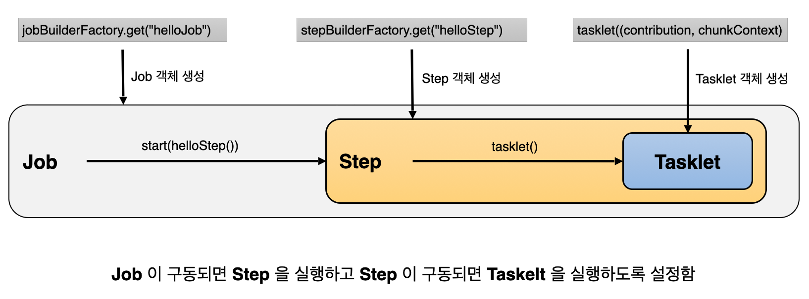

# 스프링 배치 시작

## 1. 프로젝트 구성 및 의존성 설정

### 스프링 배치 활성화

* `@EnableBatchProcessing`&#x20;
  * 스프링 배치가 작동하기 위해 선언해야 하는 어노테이션
  * 총 4개의 설정 클래스를 실행시키며 스프링 배치의 모든 초기화 및 실행 구성이 이루어진다
  * 스프링 부트 배치의 자동 설정 클래스가 실행됨으로 빈으로 등록된 모든 Job을 검색해서 초기화와 동시에 Job을 수행하도록 구성됨

### 스프링 배치 초기화 설정 클래스

* `BatchAutoConfiguration`
  * 스프링 배치가 초기화 될 때 자동으로 실행되는 설정 클래스
  * Job을 수행하는 `JobLauncherApplicationRunner` 빈을 생성
* `SimpleBatchConfiguration`
  * `JobBuilderFactory`와 `StepBuilderFactory` 생성
  * 스프링 배치의 주요 구성 요소 생성 - 프록시 객체로 생성됨
* `BatchConfigurerConfiguration`
  * `BasicBatchConfigurer`
    * `SimpleBatchConfiguration`에서 생성한 프록시 객체의 실제 대상 객체를 생성하는 설정 클래스
    * 빈으로 의존성 주입 받아서 주요 객체들을 참조해서 사용할 수 있다.
  * `JpaBatchConfigurer`
    * JPA 관련 객체를 생성하는 설정 클래스
  * <mark style="background-color:yellow;">사용자 정의</mark> <mark style="background-color:yellow;"></mark><mark style="background-color:yellow;">`BatchConfigurer`</mark> <mark style="background-color:yellow;"></mark><mark style="background-color:yellow;">인터페이스를 구현하여 사용할 수 있음</mark>

## 2. Hello Spring Batch 시작하기

```java
@Configuration
public class HelloJobConfiguration { // Job을 정의
    private final JobBuilderFactory jobBuilderFactory;
    private final StepBuilderFactory stepBuilderFactory;
    
    public HelloJobConfiguration(JobBuilderFactory jobBuilderFactory, 
                                 StepBuilderFactory stepBuilderFactory) {
         this.jobBuilderFactory = jobBuilderFactory;
         this.stepBuilderFactory = stepBuilderFactory;
    }
    
    @Bean
    public Job helloJob() {
         return jobBuilderFactory.get("helloJob") // Job 생성
                 .start(helloStep())
                 .build();
    }
    
    @Bean
    public Step helloStep() {
         return stepBuilderFactory.get("helloStep") // Step 생성
                 .tasklet((contribution, chunkContext) -> {
                     System.out.println("Hello Spring Batch");
                     return RepeatStatus.FINISHED; // tasklet은 기본적으로 무한 반복이지만 RepeatStatus.FINISHED 또는 null을 리턴해주면 1번만 실행하고 종료한다.
                 })
                 .build();
    }
    
}
```

* `@Configuration` 선언
  * 하나의 배치 Job을 정의하고 빈 설정
* `JobBuilderFactory`
  * Job을 생성하는 빌더 팩토리
* `StepBuilderFactory`
  * Step을 생성하는 빌더 팩토리
* `Job`
  * helloJob 이름으로 Job 생성
* `Step`
  * helloStep 이름으로 Step 생성
* `Tasklet`
  * Step 안에서 단일 태스크로 수행되는 로직 구현

<figure><figcaption></figcaption></figure>

<figure><figcaption></figcaption></figure>

## 3. DB 스키마 생성

### 스프링 배치 메타 데이터

* 스프링 배치의 실행 및 관리를 위한 목적으로 여러 도메인들(Job, Step, JobParameters...)의 정보들을 저장, 업데이트, 조회할 수 있는 스키마 제공
* 과거, 현재의 실행에 대한 세세한 정보, 실행에 대한 성공과 실패 여부 등을 일목요연하게 관리함으로써 배치운용에 있어 리스크 발생 시 빠른 대처 가능
* DB와 연동할 경우 필수적으로 메타 테이블이 생성되어야 함

### 스키마 생성 설정

* 수동 생성 - 쿼리 복사 후 직접 실행
* 자동 생성 - `spring.batch.jdbc.initialize-schema` 설정
  * &#x20;`ALWAYS`
    * 스크립트 항상 실행
    * RDBMS 설정이 되어 있을 경우 내장 DB 보다 우선적으로 실행
  * `EMBEDDED`
    * 내장 DB일 때만 실행되며 스키마가 자동 생성됨, 기본값
  * `NEVER`
    * 스크립트 항상 실행 안함
    * 내장 DB일 경우 스크립트가 생성이 안되기 때문에 오류 발생
    * 운영에서 수동으로 스크립트 생성 후 설정하는 것을 권장
